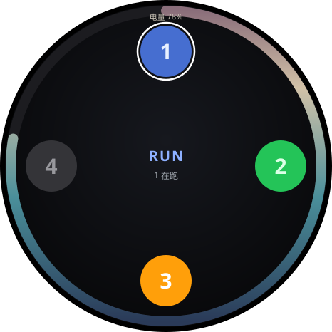

# Grok Command Watch

[中文](README.md) · [English](README.en.md)

A **Ghostty + Grok** dashboard on the M5Stack StopWatch **C152**.

Four live `grok` panes on your wrist: who is thinking, who finished, who needs you. Tap a pad to focus that input.

By [hueyluox](https://github.com/hueyluox). **Not Codex Micro. Not a ChatGPT Desktop skin.**

<p align="center">
  
</p>

Chinese is the default. This page is the English translation.

## What it does

| On the watch | On the Mac |
|---|---|
| Four digits | Four live `grok` processes, TTY order |
| Blue breathe | Running, or Waiting for response |
| Green | Turn finished |
| Gray | Opened, no prompt yet |
| Amber | Permission prompt |
| Red | Failed |
| Missing pad | That pane is not open |
| Tap 1–4 | Focus that Ghostty pane |
| Right blue | Enter |
| Left yellow | 闪电说 (watch mic, **unverified**) |
| Outer ring | Battery, dusk gradient; display stays on |

Launchers for two tabs, each split:

```text
g1   ⌘1 top     1L
g2   ⌘1 bottom  1R
g3   ⌘2 top     2L
g4   ⌘2 bottom  2R
```

Pads follow live TTYs. `g4` bound as `2R` still shows as pad 4.

## What it does not do

- No Codex / ChatGPT Desktop, no quota ring, no Cmd+Enter send.
- No conversation text, tokens, paths, or accounts on the watch.
- No on-watch tool approval in this release.
- Watch-mic → 闪电说 is not signed off. Keyboard right-Command + DJI mic is a separate path.

Board bring-up (power rail, AMOLED sleep forward) is adapted from
[digitsisyph/codex-micro-stopwatch](https://github.com/digitsisyph/codex-micro-stopwatch) (MIT).
See [NOTICE.md](NOTICE.md).

## You need

- **M5Stack StopWatch Dev Kit, SKU C152**. No other M5 boards.
- Mac with Bluetooth, macOS 14+.
- Data-capable USB-C for the first flash. Daily use can be BLE only.
- PlatformIO, Swift 5.10+ (Xcode CLT), Ghostty, local `grok`.

The flash port must be the Espressif **USB JTAG/serial debug unit**. Do not use an Anker `/dev/cu.usbmodemSN…`.

## Install

No prebuilt app or DMG. Build on the Mac that will pair.

```bash
git clone https://github.com/hueyluox/grok-command-watch.git
cd grok-command-watch

bash host/install.sh
export PATH="$HOME/.grok/command-watch/bin:$PATH"

bash companion/wrap.sh
```

`install.sh` writes LaunchAgent templates and does **not** bootstrap them:

```bash
launchctl bootstrap gui/$(id -u) ~/Library/LaunchAgents/local.grok-command-watch.plist
launchctl bootstrap gui/$(id -u) ~/Library/LaunchAgents/local.grok-command-watch-keys.plist
```

Only **one** keys daemon. Extra copies break the IME.

### Firmware

1. Plug USB-C into the C152.
2. `ls /dev/cu.usbmodem*` and pick the JTAG port, not Anker.
3. Build, then flash that exact port:

```bash
export PATH="$HOME/.grok/command-watch/bin:$PATH"
pio run -e m5stack-stopwatch
pio run -e m5stack-stopwatch --target upload --upload-port /dev/cu.usbmodemXXXX
```

The companion holds the serial port. Before flash:

```bash
launchctl bootout gui/$(id -u)/local.grok-command-watch
# after upload
launchctl bootstrap gui/$(id -u) ~/Library/LaunchAgents/local.grok-command-watch.plist
```

Grant Bluetooth to **Grok Command Watch**, Accessibility to the keys-daemon Python. Pair **GrokWatch**.

### No hardware

```bash
python3 host/sim_states.py
```

Expect `32 passed`.

## Daily use

Two Ghostty tabs, each split, `g1`–`g4`.  
After source edits: reflash firmware; `companion/wrap.sh` then kickstart; `host/install.sh` to copy `roster.py` / `keys_daemon.py` into `~/.grok/command-watch`.

Source and runtime are two trees. See [docs/LAYOUT.md](docs/LAYOUT.md).

## Factory restore

https://docs.m5stack.com/en/guide/restore_factory/stopwatch

USB-C in, hold reset ~2s to green LED, flash the factory bin with M5Burner.

## Docs

| File | |
|------|--|
| [NOTICE.md](NOTICE.md) | Whose work, what was adapted |
| [docs/LAYOUT.md](docs/LAYOUT.md) | Repo vs `~/.grok/command-watch` |
| [docs/PROTOCOL.md](docs/PROTOCOL.md) | BLE GATT |
| [docs/C152-开源项目.md](docs/C152-开源项目.md) | Other C152 firmware (Chinese) |

## License

MIT. Keep the three copyright lines in `LICENSE` (hueyluox, imliubo, codex-micro-4-stopwatch contributors).
