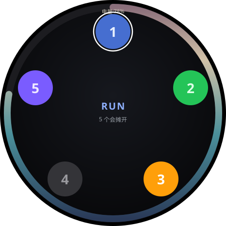

# Grok Command Watch

[中文](README.md) · [English](README.en.md)

A wrist dashboard for the Grok panes in Ghostty. Tap a number to jump to that pane.

Hardware: M5Stack StopWatch **C152**.

<p align="center">
  
  &nbsp;
  
</p>

Type `grok` in Ghostty. One ball per pane, equally spaced from 12 o'clock. With five, pads 2/3/4 leave the 3/6/9 spots. Same size through 8, slightly smaller at 9–10, paging only after 10.

Blue = running, green = done, gray = idle, amber = needs you, red = failed.  
The outer ring is battery; how far it goes is how much is left. The percentage sits at the top.

Left yellow = voice (watch mic not signed off). Right blue = Enter. Screen stays on.

Chinese is the default page.

## You need

- This watch: **C152**. Do not flash other M5 boards.
- A Mac with Bluetooth, macOS 14+
- A data USB-C cable for the first flash (BLE is enough after that)
- PlatformIO, Xcode CLT, Ghostty, local `grok`

Flash port = Espressif **USB JTAG**. Skip the Anker `SN…` port.

## Install

Build on the Mac you will pair. No prebuilt app.

```bash
git clone https://github.com/hueyluox/grok-command-watch.git
cd grok-command-watch

bash host/install.sh
export PATH="$HOME/.grok/command-watch/bin:$PATH"

bash companion/wrap.sh
```

Then load the agents yourself (`install.sh` does not bootstrap):

```bash
launchctl bootstrap gui/$(id -u) ~/Library/LaunchAgents/local.grok-command-watch.plist
launchctl bootstrap gui/$(id -u) ~/Library/LaunchAgents/local.grok-command-watch-keys.plist
```

Only one keys daemon.

### Flash

1. Plug USB-C into the watch
2. `ls /dev/cu.usbmodem*` and pick the JTAG port
3. Stop the companion first or the port is busy

```bash
export PATH="$HOME/.grok/command-watch/bin:$PATH"
launchctl bootout gui/$(id -u)/local.grok-command-watch

pio run -e m5stack-stopwatch --target upload --upload-port /dev/cu.usbmodemXXXX

launchctl bootstrap gui/$(id -u) ~/Library/LaunchAgents/local.grok-command-watch.plist
```

Bluetooth for **Grok Command Watch**, Accessibility for the keys Python. Pair **GrokWatch**.

No watch? `python3 host/sim_states.py` should print `32 passed`.

## Daily

Type `grok` in as many Ghostty panes as you want. `g1`–`g4` now just start `grok`.

After edits: reflash; `companion/wrap.sh`; `host/install.sh` to copy host scripts. Source and runtime are two trees. [docs/LAYOUT.md](docs/LAYOUT.md)

## Factory restore

https://docs.m5stack.com/en/guide/restore_factory/stopwatch

USB-C in, hold reset ~2s to green, M5Burner the factory bin.

## More

- [NOTICE.md](NOTICE.md) — what was adapted
- [docs/LAYOUT.md](docs/LAYOUT.md) — folders
- [docs/PROTOCOL.md](docs/PROTOCOL.md) — BLE
- [docs/C152-开源项目.md](docs/C152-开源项目.md) — other C152 firmware (Chinese)

## License

MIT. Keep the three copyright lines in `LICENSE`.
